# henrybk

# 一个快速开发的前后端分离脚手架

---

## 官方网站

[https://www.henrybk.com](https://www.henrybk.com)

## 项目介绍

henrybk  是一个前后端分离后台管理系统

### 系统功能

* 首页
* 系统管理
  * 用户管理
  * 角色管理
  * 菜单管理
  * 部门管理
  * 岗位管理
  * 字典管理
  * 配置管理
* 系统监控
  * 登录日志
  * 操作日志

## 软件架构

**项目服务器端架构 ： SpringBoot + MyBatisPlus + SpringSecurity**

**前端架构：Node.js + Npm + Vue + ElementUI + Axios**

### 后端技术

* SpringBoot：简化新Spring应用的初始搭建以及开发过程
* MyBatis-Plus：持久层框架
* Mysql：关系型数据库
* Spring Cache：缓存组件
* Redis：数据缓存
* Spring Security：权限认证
* Swagger2：Api接口文档工具
* Lombok：简化代码开发工具
* EasyExcel：Excel快速处理工具
* AOP：全局日志记录

### 前端技术：

* Node.js
* Npm
* Vue
* ElementUI
* Axios
* echarts

---

### 技术文档

* Spring Boot中文文档：[https://springdoc.cn/spring-boot/](https://springdoc.cn/spring-boot/)
* Spring Security中文文档：[https://springdoc.cn/spring-security/](https://springdoc.cn/spring-security/)
* Mybatis Plus：[https://baomidou.com/pages/24112f/](https://baomidou.com/pages/24112f/)
* knife4j（Swagger增强）[https://doc.xiaominfo.com/v2/documentation/description.html](https://doc.xiaominfo.com/v2/documentation/description.html)
* EasyExcel：[https://easyexcel.opensource.alibaba.com/](https://easyexcel.opensource.alibaba.com/)
* Vue.js：[https://cn.vuejs.org](https://cn.vuejs.org)
* ElementUI：[https://element.eleme.cn/#/zh-CN/component/installation](https://element.eleme.cn/#/zh-CN/component/installation)
* vue-element-template：[https://panjiachen.gitee.io/vue-element-admin-site/zh/guide/](https://panjiachen.gitee.io/vue-element-admin-site/zh/guide/)
* Echarts：[https://echarts.apache.org/zh/index.html](https://echarts.apache.org/zh/index.html)

#### 安装教程

**后端**
1、创建mysql数据库，数据库名：`henrybk`
2、执行 `doc\sql`目录下sql脚本
3、安装 `redis`，并启动
4、修改 `henrybk_parent\service_system\src\main\resources`下 `application.properties`文件的mysql数据库连接及redis配置信息
5、打开主启动类 `SystemApplication.java`启动项目
6、控制台出现 `henrybk`Banner则启动成功

**前端**
1、打开终端，执行 `npm install`安装npm包，
2、安装完成后，执行 `npm run dev`启动项目
3、启动完成后，访问[http://localhost:8887/](http://localhost:8887/)

---

#### 演示效果图

**登录账号：admin/123456,test/123456**

**首页**
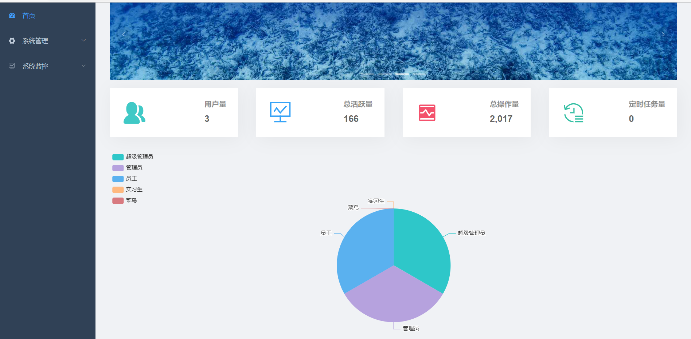

**用户首页**
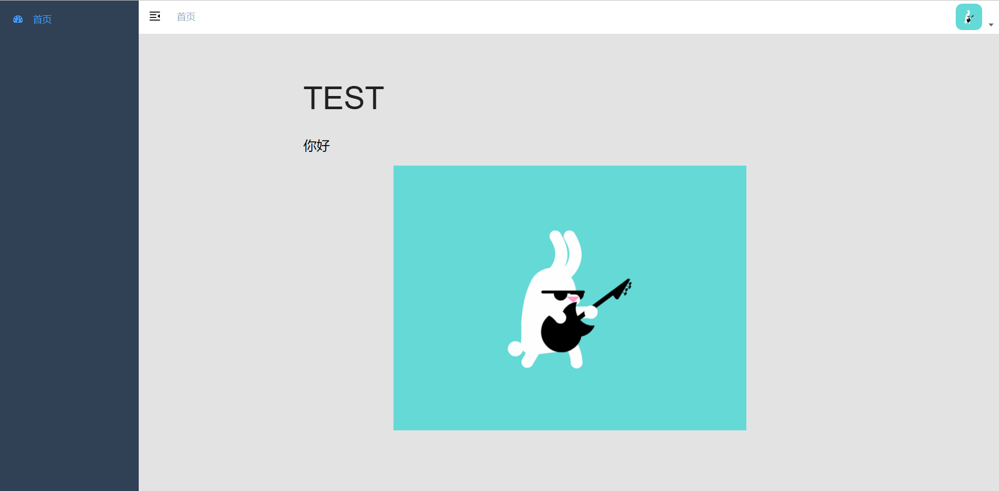

**个人中心**
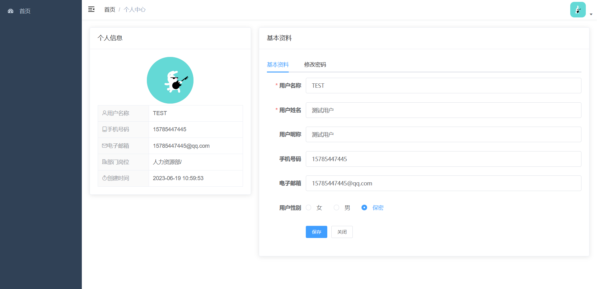

**用户管理**
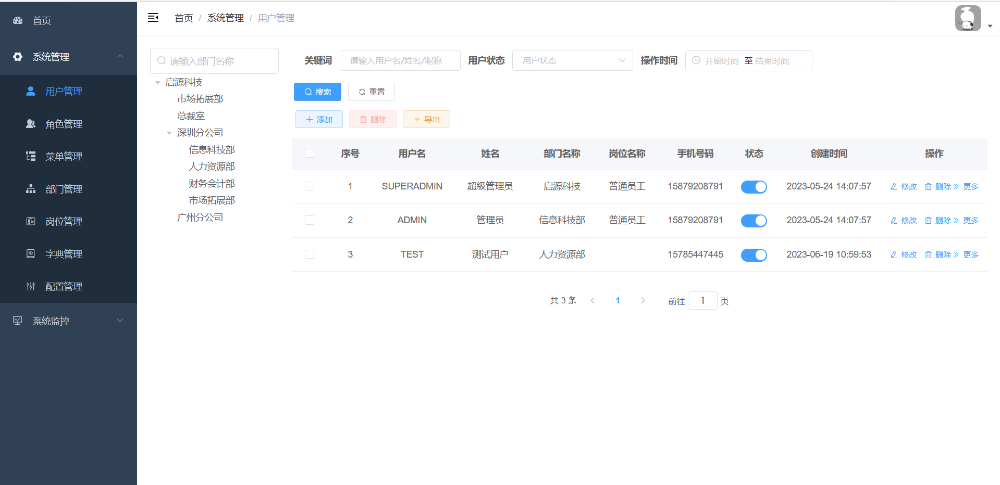

**角色管理**
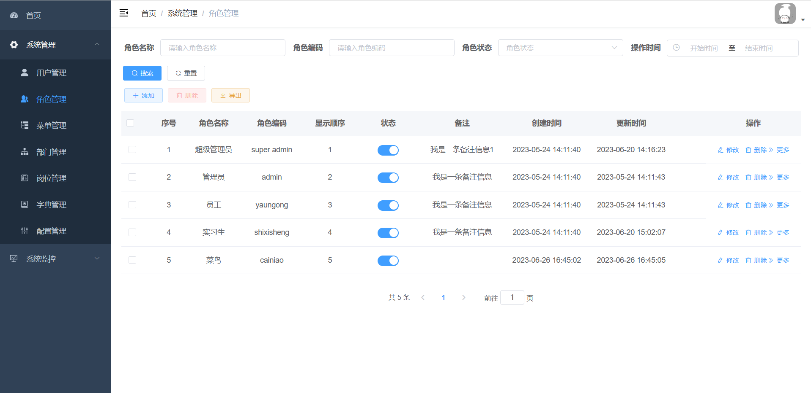

**菜单管理**
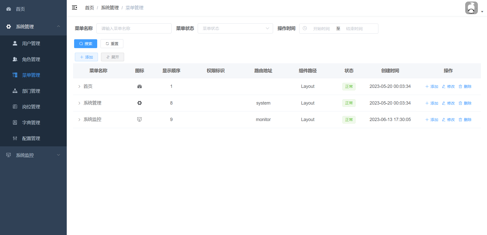

**部门管理**
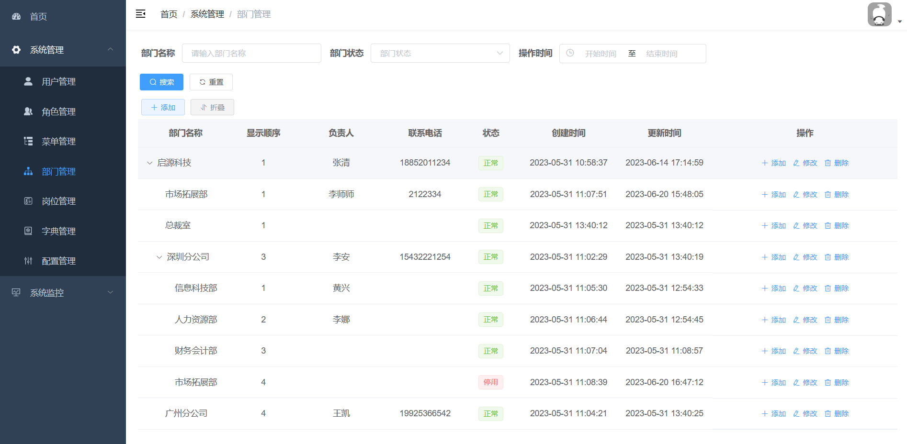

**岗位管理**
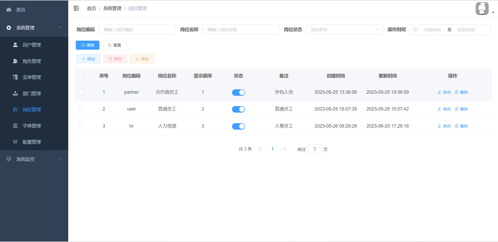

**字典管理**
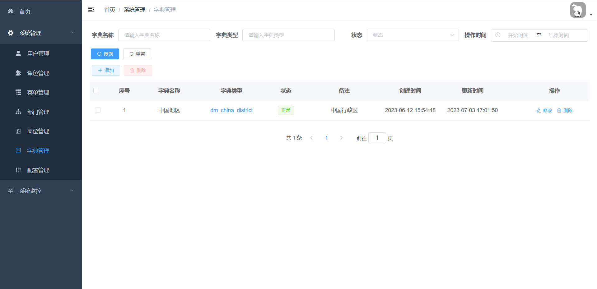

**配置管理**
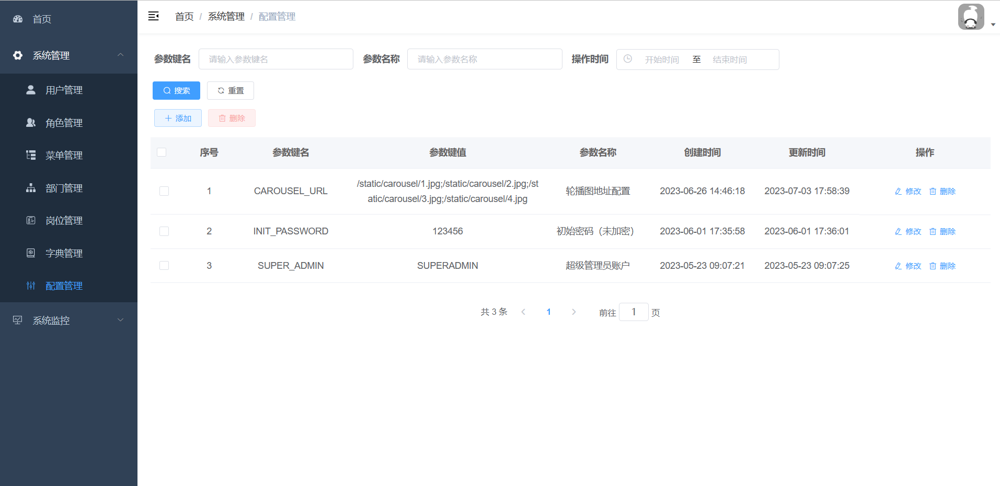

**登录日志**
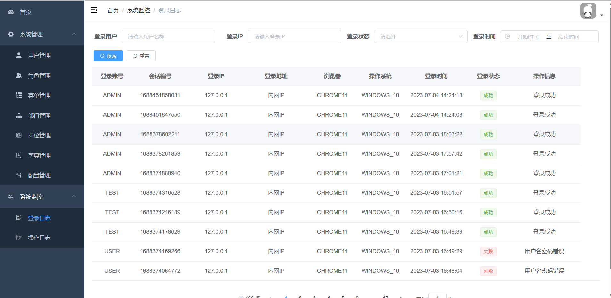

**操作日志**
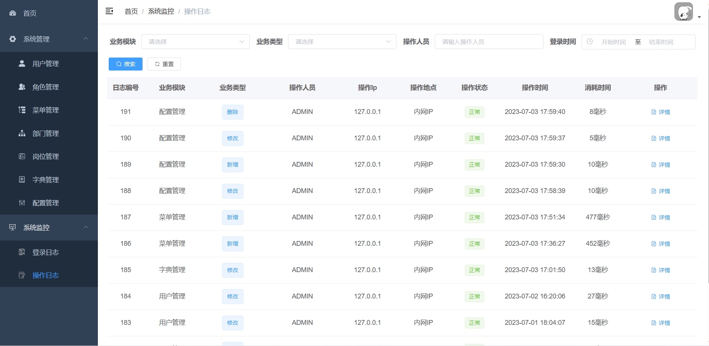
